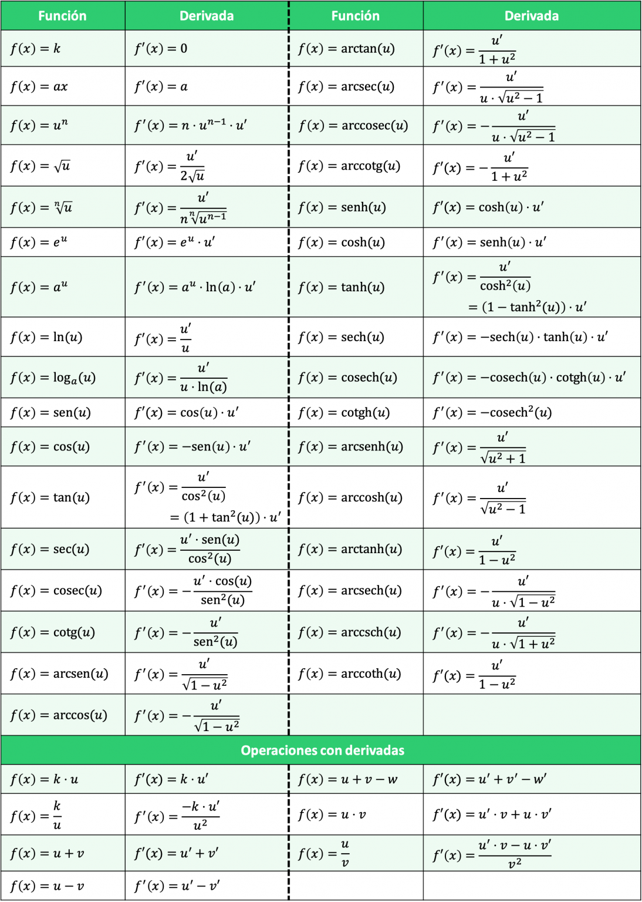

# Descripcion de la asignatura

# LIBRO

## Tema I

Preliminares. Apéndice I, números complejos.

Capítulo 1: Límites y continuidad. Apéndice II, Funciones continuas.

## Tema II

Capítulo 2: Diferenciación (sección 2.11, optativa).

Capítulo 3: Funciones trascendentes (no entra la sección 3.7).

Capítulo 4: Aplicación de las derivadas (sección 4.5,  optativa). 

## Tema III

Capítulo 5: Integración. Apéndice IV, la integral de Riemann.

Capítulo 6: Técnicas de integración (secciones 6.7 y 6.8, optativas).

Capítulo 7: Aplicaciones de la integración (secciones 7.5, 7.6 y  7.8, optativas. No entran las secciones 7.7 y 7.9).

## Tema IV

Capítulo 9: Sucesiones, Series y series de potencias.

[[Metodologia_contenido]]

#analisis

